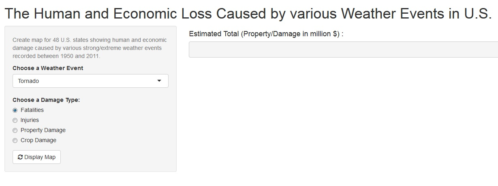

---
title       : Shiny Application
subtitle    : Developing Data Product - project
author      : Nasir Jamal Khan
job         : Learner! 
framework   : io2012        # {io2012, html5slides, shower, dzslides, ...}
highlighter : highlight.js  # {highlight.js, prettify, highlight}
hitheme     : tomorrow      # 
widgets     : []            # {bootstrap, quiz, shiny}
mode        : selfcontained # {standalone, draft}
knit        : slidify::knit2slides
---  
## Developing Data Product - Project

This is a shiny application developed and deployed as a part of project for the course Developing Data Product.  
* **Input:**  
    + Select a Weather Event Type from the selectInput widget.  
    + select a Damage type from the radioButton group widge.  
    + Click on actionButton "Draw Map" to View the Result (requires clicking the firs time).  
* **Output:**
    + Total sum of the Selected Damage Type and the Selected Weather Event Type.
    + Map of 48 U.S. States showing all the Magnitude of Damage Type.

--- .class #id 

## Accessing and Running the Appliation

*Application can be accessed at the following link:*  
URL: ** http://njkhan786.shinyapps.io/ddp_project**

*The Application opens up as the following screen:*  

<div style='text-align: center;'>
    
</div>

---  

*After you choose the Event type and Damage Type the screen would like the following:*   

*You only need to click "Draw map" button the first time*  

<div style='text-align: center;'>
    
</div>

---  
## About Data:
* Data Source: U.S. National Oceanic and Atmospheric Administration's (NOAA)
storm database.  
* Time Period: It includes the data from 1950 through November 2011.  
* Data Perparation: Data includes:  
    + Events which caused either Human or economic damage.  
    + Events occured inside 48 U.S. states.  
    + Occurances with the correct Latitude/Longitude i.e. which fits to U.S.map.

---  
## ui.R
```{r opts.label = 'shiny'}
slidifyUI(
  sidebarPanel(
    selectInput('sex', 'Choose Sex', c('Male', 'Female')),
    selectInput('type', 'Choose Type',
      c('multiBarChart', 'multiBarHorizontalChart')
    )
  ),
  mainPanel(
    tags$div(id = 'nvd3plot', class='shiny-html-output nvd3 rChart')
  )
)
```


